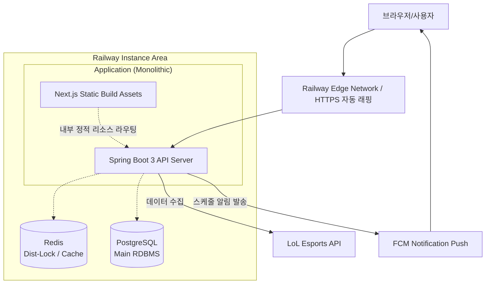

# JILoL.gg

> **운영 안정성과 성능 최적화에 집중한 실시간 LoL e스포츠 서비스 플랫폼**  
> JWT 무상태 인증, Spring Batch 병렬 처리 및 FCM 비동기 푸시 알림을 도입해 백엔드 인프라 아키텍처를 점진적으로 진화시킨 프로젝트입니다.

📎 [GitHub Repository](https://github.com/ji1007k/jilolgg-monolith)  
🌐 [서비스 바로가기](https://jilolgg.up.railway.app/jikimi)

---

## 📌 주요 아키텍처 발전 과정 (Refactoring & Trade-off)

SI 실무 체계에서의 개발 경험을 바탕으로, 단순한 기능 구현을 넘어 **"운영 복잡도 감소와 인프라 비용 절감"**이라는 프로덕트 엔지니어(Product Engineer)의 시각으로 서비스를 지속 개선했습니다.

**1. 상태 독립적인 모놀리식(Monolithic) 아키텍처로의 전환**
- **문제:** 기존 프론트엔드(Next.js)와 백엔드(Spring Boot) 컨테이너의 분리 및 Nginx 리버스 프록시 계층이 운영 복잡도를 증가시키고 배포 파이프라인 및 로컬 테스트에 오버헤드를 유발했습니다.
- **해결:** Gradle의 `NpmTask`를 튜닝하여 빌드 타임에 Next.js를 컴파일하고 이를 Spring Boot의 정적 리소스로 통합 배치하는 단일 파이프라인을 구축했습니다.
- **결과:** 인프라 자원(Nginx 및 추가 컨테이너) 절약, 버전 파편화 방지 및 배포 사이클 일원화 달성.

**2. 리소스 최적화를 위한 WebSocket → FCM 큐 푸시 전환**
- **문제:** Redis Pub/Sub을 활용한 실시간 통신은 지속적인 세션 폴링으로 인해 동시 접속자 수 증가 시 무의미한 서버 메모리 점유 및 확장성 한계가 예상되었습니다.
- **해결:** 리소스 소비가 큰 WebSocket 통신망을 걷어내고, 경기 시작 등 중요한 정보만 **FCM (Firebase Cloud Messaging) 비동기 푸시 아키텍처**로 전환했습니다. 
- **결과:** 단기 인스턴스의 소켓 메모리 부담 및 네트워크 비용 감소, 안정적인 단방향 모바일 웹 메시지 시스템 구축.

---

## 🛠 기술 스택

**Backend** | Java 17, Spring Boot 3 (MVC, Security, Batch, Data JPA)  
**Database** | PostgreSQL 15, Redis 7 (Cache, Distributed Lock)  
**Frontend** | Next.js 15, Vanilla CSS  
**Infra & APIs** | Railway, Docker, GitHub Actions, Firebase Admin(FCM), LoL Esports API  

---

## 💡 핵심 백엔드 엔지니어링 

### 1. Spring Batch 데이터 동기화 최적화 (95% 시간 단축)
- **목적:** 외부의 방대한 LoL Esports API 데이터를 수집, 정제하여 효율적으로 자체 DB로 이관.
- **최적화 (Partitioning):** 단일 스레드 기반 I/O 병목 트러블을 파악 후, 리그별 파티셔닝(Partitioning)을 도입해 스레드 풀 기반 병렬 Chunk 처리를 구현.
- **성과:** 평균 **92.5초가 소요되던 전체 API 갱신 작업을 4.7초로(약 95% 단축)** 획기적으로 개선하며 I/O 병목 돌파.

### 2. Redisson 분산 락(Distributed Lock) 기반 동시성 제어
- 클라우드 환경 다중 인스턴스의 분산 스케줄링 시 배치(Batch) 중복 처리를 막기 위해 분산 락 환경 구성.
- **기술 선택 이유:** Spin-lock 방식인 일반 Redis `setnx` 대신 대기열 관리가 가능한 **Redisson의 Pub/Sub Lock** 모델을 선택하여, 트래픽 폭주 시 인프라망을 보호하고 무의미한 Lock 재시도 부하를 방어.

### 3. 무상태형(Stateless) JWT 기반 인증 아키텍처 구축
- Spring Security 및 JWT (Access 1시간 / Refresh 단기 갱신) 조합으로 서버 스케일아웃에 유리한 무상태 보안 구성.
- HTTP-Only 쿠키를 통한 XSS 1차 필터링 및 클라이언트-서버 간 보안 검증 로직으로 공격 표면(Attack Surface) 축소.

### 4. 선제적 캐시 분산(Caching)을 통한 DB 리드(Read) 부하 억제
- 경기 결과표(30분), 토너먼트 데이터(3일), 리그 메타(7일) 등 데이터 변동 라이프사이클에 맞춰 Redis TTL을 세밀 조정해 API 응답성능 강화.
- 외부 데이터 동기화 배치가 끝나는 즉시 스프링 `@CacheEvict`를 호출해 데이터 페칭의 정합성 불일치 원천 차단.

---

## ⚡ TroubleShooting (문제 해결 역량)

*(※ 실제 이력서 제출 시 노션이나 블로그 상세 포스팅 링크를 걸어두세요)*

- **[장애 극복]** Next.js의 App Router 정적 렌더링 방식과 Spring Boot 정적 자원 핸들링(`forward:/`) 사이의 라우팅 충돌 현상 원인 규명 및 리다이렉트 필터 구축기
- **[안정성 처리]** 대규모 외부 API 병렬 폴링(Polling) 시 발생하는 `429 Too Many Requests` 예외에 대비한 Spring Batch 의 Chunk 재시도(Retry) 최적화 전략
- **[CI/CD 전략]** Gradle 빌드 정책 튜닝: `processResources` 단계 의존성 주입을 활용해 로컬과 클라우드 운영 환경 간의 권한(Execution Policy) 이슈를 우회하는 통합 무중단 빌드 파이프라인
- **[CORS 및 보안 인증]** 로컬 프론트엔드(Next.js, 3000)와 백엔드(Spring Boot, 8080) 물리적 분리 환경에서 무상태(Stateless) JWT 기반의 HTTP-Only 쿠키 인증 시 발생한 Preflight CORS 에러 극복 과정 (Spring Security내 `allowCredentials` 및 `allowedOriginPatterns` 통제)

---

## 🏗 개선된 통합 시스템 아키텍처 (Current)

스프링 부트(Spring Boot) 내장 톰캣 서버가 정적 에셋(Next.js 최적화 빌드 파일)까지 일괄 응답하며, 불필요한 프록시 계층을 줄여 인프라 비용과 관리 복잡도를 제로에 가깝게 유지합니다.

