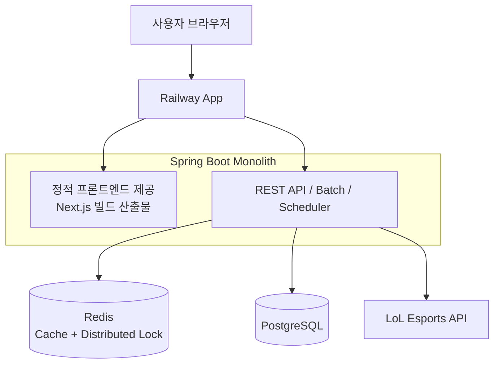

# JILoL.gg

> **외부 API 동기화 파이프라인 최적화 및 데이터 정합성 개선 프로젝트**

  - **서비스**: [https://jilolgg.up.railway.app/jikimi](https://jilolgg.up.railway.app/jikimi)
  - **저장소**: [https://github.com/ji1007k/jilolgg-monolith](https://github.com/ji1007k/jilolgg-monolith)

## 프로젝트 목표

LoL Esports 외부 API 데이터를 안정적으로 수집하고, 데이터 **정합성** 및 **시스템 운영 안정성** 확보를 목표로 합니다.

## 🛠 핵심 문제 해결 (Problem Solving)

### 1\. 배치 처리 성능 최적화 (Throughput 개선)

  * **문제**: 데이터 누적으로 단일 스레드 방식의 동기화 시간이 선형 증가하여 데이터 반영 지연 발생.
  * **해결**: **Spring Batch Partitioning** 기반 병렬 처리 적용. 작업을 독립적인 Step으로 분할하여 서버 리소스 활용도를 극대화했습니다.
  * **결과**: 동기화 소요 시간 **92.5s → 4.7s (약 95% 단축)**.
  * **파티션 수/동시성 튜닝 계획 (Future Work)**
      * 현재는 고정값(`gridSize=5`)으로 운영 중이며, 아래 기준으로 점진 튜닝할 예정
      * `partition = min(리그 수, DB 허용 동시성, 외부 API 허용 동시성, CPU 한계)` 원칙으로 산정
      * DB 기준: `Hikari maxPool - 웹 트래픽 예약분` 이내로 제한
      * 외부 API 기준: `허용 RPS × API p95 지연시간(초)` 범위에서 시작, 429/타임아웃 증가 시 즉시 축소
      * 운영 지표(배치 시간, DB active/pending, API 실패율, executor queue) 관측 후 단계적으로 조정

### 2\. 분산 환경에서의 동시 실행 제어 (Concurrency Control)

  * **문제**: 정기 배치 작업과 운영자의 수동 업데이트가 겹칠 경우, 데이터 중복 갱신 및 DB 락 경합 리스크 존재.
  * **해결**: **Redisson(Redis) 분산 락** 도입으로 단일 실행 보장.
      * **JPA 비관적 락 대비 강점**: 실행 시간이 긴 배치 작업이 DB 커넥션을 오래 점유하여 발생하는 **커넥션 풀 고갈(Starvation)** 문제를 방지하기 위해 락 메커니즘을 DB 외부(Redis)로 격리했습니다.

### 3\. 조회 성능과 데이터 최신성 유지 (Caching Strategy)

  * **문제**: DB 부하 감소를 위해 캐시를 사용하나, 데이터 수정 직후 사용자에게 \*\*업데이트 전의 과거 데이터(Stale Data)\*\*가 노출되는 현상.
  * **해결**: 데이터 변경(동기화/수정/삭제) 이벤트 발생 시 관련 **캐시를 즉시 삭제(Eviction)** 하도록 설계하여, 사용자가 항상 최신 데이터를 조회할 수 있도록 정합성을 확보했습니다.

### 4\. 이기종 데이터 소스 통합 및 병합 (Data Deduplication)

  * **문제**: 외부 API와 수동 등록 데이터의 식별자가 달라 동일 경기가 중복 노출되는 이슈.
  * **해결**: `match_external_mapping` 테이블을 통한 **연결 정보 추상화**. 조회 레이어에서만 병합(Dedupe) 로직을 적용하여 원본 데이터는 보존하되 사용자에게는 정제된 단일 뷰를 제공합니다.

### 5\. 아키텍처 단순화 및 운영 효율 개선 (Cost-Efficiency)

  * **문제**: 개인 프로젝트 규모에서 FE/BE 분리 운영으로 인한 인프라 관리 및 배포 공수 과다.
  * **해결**: Next.js 산출물을 Spring Boot 내부로 통합한 **모놀리스 단일 배포**로 전환. 동일 출처(Same-origin) 구성을 통해 CORS 이슈를 제거하고 운영 관리 포인트를 최소화했습니다.
  * **참고 문서**
      * 현재 아키텍처: `README.md`의 `개선된 통합 시스템 아키텍처 (Current)`
      * 과거 아키텍처(레거시): [docs/architecture.md](docs/architecture.md), [docs/archive/legacy-2025/infra.md](docs/archive/legacy-2025/infra.md)

## 개선된 통합 시스템 아키텍처 (Current)



-----

## 기술 스택 (Tech Stack)

  * **Backend**: Java 17, Spring Boot 3.3.1, Spring Batch, Spring Security, Spring Data JPA
  * **Frontend**: Next.js 15, React 19
  * **Storage**: PostgreSQL, Redis (Redisson)
  * **Infra**: Railway, Docker, GitHub Actions, Firebase Admin SDK

## 문서 (Documentation)

  - [데이터 모델링 (ERD)](docs/erd.md)
  - [API 가이드 (Swagger)](docs/swagger-api-guide.md)
  - [성능 최적화 리포트](docs/report/optimization/summary.md)
  - [아카이브](docs/archive/)

## 실행 방법

```bash
# 프론트엔드 빌드 및 백엔드 리소스 복사
./gradlew copyFrontend

# 백엔드 실행 (dev 프로필)
./gradlew bootRun -Dspring.profiles.active=dev

# 통합 빌드 (Jar 생성)
./gradlew build -PwithFrontend
```

-----
