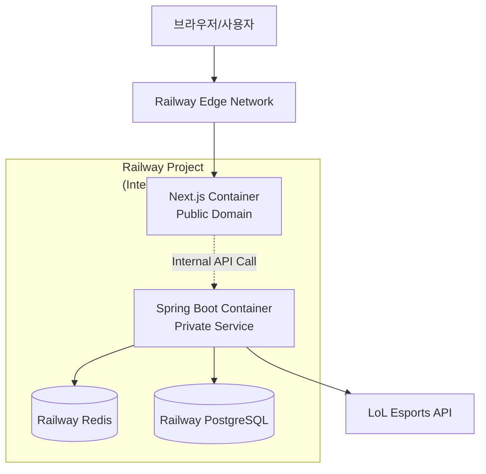
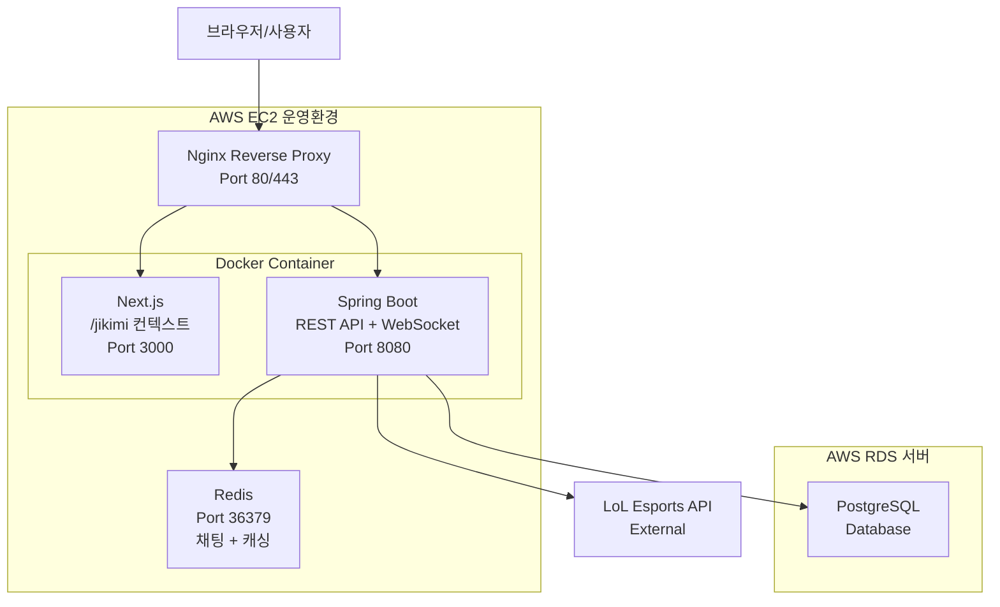

# JILoL.gg

> **실시간 LoL e스포츠 경기 정보 플랫폼**  
> JWT 인증, Spring Batch 병렬 처리, 실시간 채팅을 구현한 **백엔드 기술 학습 프로젝트**

📎 [GitHub Repository](https://github.com/ji1007k/basic-be-springboot) 
🌐 [서비스 바로가기](https://jilolgg.up.railway.app/jikimi)

---

## 프로젝트 개요

LoL Esports API를 활용하여 리그, 팀, 경기 정보를 수집하고 제공하는 백엔드 중심 웹 서비스입니다.

**핵심 목표:**
- JWT 무상태 인증 + CSRF 방어 구현
- Spring Batch 파티셔닝으로 데이터 동기화 성능 최적화
- Redis Pub/Sub 기반 실시간 채팅 구현
- 클라우드 환경 배포 및 운영 경험

---

## 기술 스택

**Backend** | Java 17, Spring Boot 3 (MVC, Security, Batch, Data JPA), Redisson  
**Database** | PostgreSQL 15, Redis 7 (Cache, Pub/Sub, Distributed Lock)  
**Infra** | Railway, Docker, GitHub Actions
**Infra (Before)** | AWS EC2/RDS, Docker, Nginx, GitHub Actions
**External API** | LoL Esports API 

---

## 주요 기능

### JWT 기반 인증
- **무상태 인증**: Spring Security + JWT (Access 1시간 / Refresh 7일)
- **보안**: httpOnly 쿠키 + CSRF 토큰 일치 검증
- **CORS 대응**: 개발환경 프록시 미들웨어, 배포환경 Nginx 리버스 프록시

### Spring Batch 데이터 동기화
- **수집**: LoL Esports API → 정제 후 DB 저장
- **성능**: 리그별 파티셔닝으로 **95% 단축** (92.5초 → 4.7초)
- **동시성**: Redisson 분산락으로 다중 인스턴스 중복 실행 방지

### 실시간 채팅
- **양방향 통신**: WebSocket 기반 클라이언트 연결
- **메시지 분산**: Redis Pub/Sub + 각 인스턴스 로컬 세션 필터링
- **안정성**: 30초 주기 Ping으로 연결 유지

### 캐싱 및 성능 최적화
- **TTL**: 순위표 30분, 리그/토너먼트 3일, 팀 7일
- **캐시 무효화**: 데이터 동기화 후 `@CacheEvict`로 캐시 갱신
- **조회 성능**: Redis 캐시로 반복 API 호출 최소화

---

## 아키텍처(Railway)

- Railway Edge Network를 통해 트래픽 수용 (Nginx 관리 부담X)
- 백엔드는 프라이빗으로 두고, 프론트엔드(Next.js)만 퍼블릭 도메인 할당 (불필요한 외부 노출X)
- 프론트엔드와 백엔드, DB, Redis 간의 통신은 Railway 서비스 이름을 이용한 내부 네트워크 통신
- 프론트엔드 도메인에 대한 HTTPS 자동 적용 및 관리

---

## 아키텍처(Before: AWS)

- 단일 EC2 인스턴스에서 Nginx 리버스 프록시로 Docker 컨테이너화된 Next.js와 Spring Boot를 통합 운영
- PostgreSQL(AWS RDS)은 메인 저장소
- Redis는 캐싱과 채팅 메시지 중계

