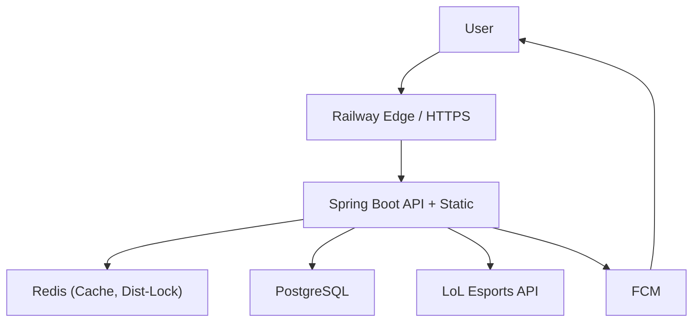

# JILoL.gg

> 외부 API 동기화 파이프라인을 성능/안정성 중심으로 개선한 백엔드 포트폴리오

🌐 서비스: [https://jilolgg.up.railway.app/jikimi](https://jilolgg.up.railway.app/jikimi)  
📎 저장소: [https://github.com/ji1007k/jilolgg-monolith](https://github.com/ji1007k/jilolgg-monolith)

---

## 1. 문제
- LoL Esports 외부 API 동기화 시 데이터 양 증가에 따라 처리시간이 길어지고, 운영 중 중복 실행/실패 복구 리스크가 커짐
- 실무 목표는 기능 추가보다 `동기화 지연시간 단축 + 실행 안정성 확보 + 운영 복잡도 감소`

## 2. 가설
- 배치 파티셔닝 병렬화, 분산 락, 캐시 무효화 타이밍 제어를 결합하면 동기화 시간을 줄이면서 안정성을 높일 수 있음

## 3. 실험
1. Spring Batch 파티셔닝 기반 병렬 처리 적용
2. Redisson 분산 락으로 동기화 중복 실행 방지
3. 동기화 완료 직후 캐시 무효화로 정합성 유지
4. 운영 구조를 단순화해 배포/운영 복잡도 축소

## 4. 결과
- 동기화 처리시간: **92.5초 -> 4.7초 (약 95% 단축)**
- 출처 1: `docs/development.md`
- 출처 2: `docs/report/optimization/performance-report.md`

주의:
- 위 수치는 과거 실험 환경 기준 결과이며, 현재 운영 환경에서 동일 수치를 보장하지 않음

## 5. 트레이드오프와 판단
- 병렬화는 처리량을 높이지만 실패/재시도/중복 실행 제어가 반드시 필요
- 분산 락은 안정성을 높이지만 락 대기/타임아웃 정책 설계가 필요
- 캐시는 응답 성능에 유리하지만 동기화 직후 무효화 전략이 없으면 정합성 문제가 생김

---

## 기술 스택
- Backend: Java 17, Spring Boot 3, Spring Security, Spring Batch, Spring Data JPA
- Frontend: Next.js 15, React 19, TailwindCSS
- Data: PostgreSQL, Redis, Redisson
- Infra/Deploy: Railway, Docker, GitHub Actions, Firebase Admin SDK

---

## 아키텍처 요약



---

## 현재 운영과 과거 실험의 경계
- **현재 운영 환경 (기준일: 2026-03-28)**: Railway 기반 통합(monolith)
- **과거 성능 실험 환경 (2025-07-31 ~ 2025-08-01)**: AWS EC2 t2.micro + Nginx

문서 사용 기준:
1. 현재 구조 설명은 이 README 기준
2. 과거 아키텍처는 `docs/architecture.md`를 이력으로 참조
3. 성능 수치는 `히스토리 수치`와 `현재 로컬 재현 수치`를 구분해 해석

---

## 로컬 재현 (현재 코드 기준)
1. 서버 실행
```bash
./gradlew bootRun
```
2. 벤치마크 실행 (PowerShell)
```powershell
powershell -ExecutionPolicy Bypass -File .\bin\benchmark-sync.ps1 -BaseUrl "http://localhost:8080" -Year 2026 -Runs 3
```
3. 결과 파일 확인
- 파일 경로: `docs/report/optimization/results/sync-benchmark-*.json`
- 포함 지표: 실행별 `elapsed_ms`, `min/median/avg/max`

---

## 문서 맵
- 개선 이력: `docs/development.md`
- 성능 리포트(히스토리): `docs/report/optimization/performance-report.md`
- 캐싱 리포트: `docs/report/optimization/caching-report.md`
- 과거 아키텍처(레거시): `docs/architecture.md`
- Swagger 운영 가이드: `docs/swagger-api-guide.md`
