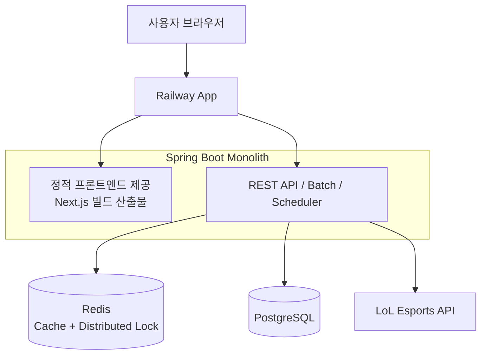

# JILoL.gg

> **백엔드 중심 프로젝트** | 외부 API 동기화 파이프라인 최적화 및 운영 안정성 강화  
> **서비스**: [바로가기](https://jilolgg.up.railway.app/jikimi) / **저장소**: [GitHub](https://github.com/ji1007k/jilolgg-monolith)

## 프로젝트 목표
- **안정적인 수집**: LoL Esports 외부 API 기반 데이터의 안정적 동기화
- **데이터 무결성**: 운영자 수동 수정 데이터와 충돌 없는 조회 정합성 유지
- **운영 효율화**: 개인 프로젝트 규모에 맞춘 아키텍처로 운영 복잡도 최소화

---

## 문제 해결

### 1. 배치 처리 성능 최적화 (Throughput 개선)
- **문제**: 데이터 누적으로 단일 스레드 방식 동기화 시간이 선형 증가하여 반영 지연 발생
- **해결**: Spring Batch Partitioning 기반 병렬 처리로 작업 단위를 분할
- **결과**: 동기화 소요 시간 `92.5s -> 4.7s` (약 95% 단축)
- **운영값**: 파티션 수는 현재 고정값(`gridSize=5`)으로 운영

---

### 2. 분산 환경 동시 실행 제어 (Concurrency Control)
- **문제**: 정기 배치와 운영자 수동 실행이 겹칠 때 중복 실행/갱신 충돌 가능
- **해결**: Redisson(Redis) 분산 락으로 단일 실행 보장
- **인사이트**: DB 비관적 락 대신 Redis 락을 사용해 DB 커넥션 점유 리스크를 분리
- **한계**: Redis 장애 시 락이 비활성화되어 중복 실행 가능성이 있으며, DB를 기준으로 정합성을 유지하도록 설계

---

### 3. 조회 성능과 최신성 동시 확보 (Caching Strategy)
- **문제**: 캐시 사용 시 수정 직후 stale 데이터 노출 가능
- **해결**: TTL 기반 캐싱 + 변경 이벤트 시 무효화(`@CacheEvict` 및 `invalidateAllCaches()`) 적용

---

### 4. 수동 데이터와 외부 데이터 중복 노출 해결 (Dedupe)
- **문제**: 동일 경기라도 식별자 차이로 2건 노출되는 문제
- **해결**: `match_external_mapping`으로 연결 정보를 관리하고, 조회 레이어에서 dedupe(표시 계층 병합) 적용
- **원칙**: 외부 API 원본 식별자는 보존하고, 표시 시점에만 병합

---

### 5. 아키텍처 단순화 및 운영 효율 개선 (Cost-Efficiency)
- **문제**: FE/BE 분리 운영으로 관리 포인트 증가 및 CORS 대응 부담
- **해결**: Next.js 산출물을 포함한 모놀리스 단일 배포로 전환, 동일 출처 구성으로 CORS 이슈 완화

---

## 시스템 아키텍처 (Current)



---

## 기술 스택 (Tech Stack)

| 구분 | 기술 스택 |
| --- | --- |
| **Backend** | Java 17, Spring Boot 3.3.1, Spring Batch, Spring Security, Spring Data JPA, Redisson |
| **Frontend** | Next.js 15, React 19 |
| **Storage** | PostgreSQL, Redis |
| **Infra** | Railway, Docker, GitHub Actions, Firebase Admin SDK |

---

## 문서 (Documentation)
- [ERD](docs/erd.md)
- [Swagger API 가이드](docs/swagger-api-guide.md)
- [성능 최적화 리포트](docs/report/optimization/summary.md)
<!-- - [Future Work](docs/future-work.md) -->
<!-- - [트레이드오프 정리](docs/interview-tradeoffs.md) -->
<!-- - [파티션 튜닝 가이드](docs/partition-tuning-step-by-step.md) -->

---

## 실행 방법

```bash
./gradlew copyFrontend
./gradlew bootRun -Dspring.profiles.active=dev
./gradlew build -PwithFrontend
```
