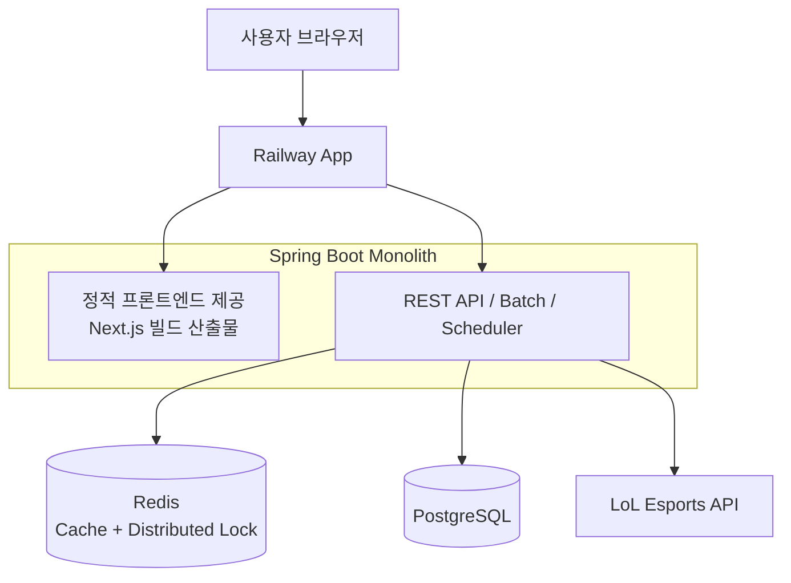

<div align="center">

# JILoL.gg

**LoL Esports 경기 일정을 한눈에 — 리그별 필터링, 즐겨찾기, 경기 시작 알림**

[](https://openjdk.org/projects/jdk/21/)
[](https://spring.io/projects/spring-boot)
[](https://nextjs.org/)
[](https://www.postgresql.org/)
[](https://redis.io/)
[](https://railway.app/)

**[서비스 바로가기](https://jilolgg.up.railway.app/jikimi)** · [API 문서](https://jilolgg.up.railway.app/api/swagger-ui) · [트레이드오프 정리](docs/interview-tradeoffs.md)

개인 프로젝트 · 2025.02 ~ 진행 중 · 백엔드 중심

</div>

---

## 미리보기

| 주간 일정 (모바일) | 일자별 경기 |
| :---: | :---: |
|  |  |
| 좌우로 밀어 주 단위 이동 | 경기별 알림 설정 |

## 이 서비스가 하는 일

- **경기 일정 조회** — 리그별·날짜별로 LoL Esports 경기 일정과 결과를 본다. 월간 달력과 주간 목록 두 가지 보기
- **팀 즐겨찾기** — 관심 팀을 상단에 고정. 일정에서도 강조 표시
- **리그 노출 순서 변경** — 자주 보는 리그를 앞으로
- **경기 시작 알림** — 원하는 경기에 FCM 푸시 알림
- **로그인 없이 사용** — 위 세 가지를 계정 없이 쓸 수 있다. 로그인은 기기 간 동기화를 원할 때만
- **운영자 기능** — 외부 API에 없는 경기를 직접 등록하고, 잘못된 정보를 덮어쓴다

데이터는 `esports-api.lolesports.com`에서 주기적으로 동기화한다.

---

## 기술적 도전과 해결

> 이 프로젝트에서 가장 시간을 쓴 부분들이다. 각 항목의 **한계와 포기한 것**은 [트레이드오프 정리](docs/interview-tradeoffs.md)에 따로 적었다.

### 1. 배치 처리 성능 최적화 — `92.5s → 4.7s`

- **문제**: 데이터가 쌓이면서 단일 스레드 동기화 시간이 선형으로 증가해 반영이 지연됐다
- **해결**: Spring Batch Partitioning으로 리그 단위 병렬 처리
- **결과**: 동기화 소요 시간 약 95% 단축
- **운영값**: 파티션 동시 실행 수는 `gridSize=5` 고정. 조정 절차는 [파티션 튜닝 가이드](docs/partition-tuning-step-by-step.md)에 관찰 지표와 롤백 기준까지 정리

### 2. 분산 환경 동시 실행 제어

- **문제**: 정기 배치와 운영자 수동 실행이 겹치면 중복 실행·갱신 충돌이 발생할 수 있었다
- **해결**: Redisson 분산 락으로 단일 실행 보장. **모든 동기화 진입점을 `MatchSyncOrchestratorService` 하나로 수렴**시켜 락을 우회할 수 없게 함
- **판단**: DB 비관적 락 대신 Redis 락을 써서 DB 커넥션 점유 리스크를 분리
- **한계**: Redis 장애 시 락이 풀려 중복 실행이 가능하다. 정합성은 DB를 기준으로 유지하도록 설계

### 3. 조회 성능과 최신성 동시 확보

- **문제**: 캐시를 쓰면 수정 직후 stale 데이터가 노출된다
- **해결**: TTL 캐싱 + 변경 시 무효화(`invalidateAllCaches()`)
- **트레이드오프**: 금일 경기 갱신은 10분마다 돌기 때문에 **의도적으로 캐시를 무효화하지 않는다.** 최신성보다 부하를 택한 지점

### 4. 수동 데이터와 외부 데이터 중복 노출

- **문제**: 같은 경기인데 식별자가 달라 2건으로 보였다
- **해결**: `match_external_mapping`에 연결 정보만 저장하고, 조회 레이어에서 병합
- **원칙**: 외부 API 원본 식별자는 **치환하지 않고 보존**한다. 병합은 표시 시점에만

### 5. 로그인 장벽 제거

- **문제**: 즐겨찾기·리그 순서·알림이 전부 로그인을 요구해서, 처음 들어온 사용자는 아무것도 자기 취향대로 바꿀 수 없었다
- **해결**: 기능의 성격에 따라 저장 위치를 나눔
  - 즐겨찾기·리그 순서는 **이 브라우저의 취향**이므로 비로그인은 `localStorage`. 서버 호출 자체가 없다
  - 알림은 서버가 구독 정보를 알아야 하므로 주체를 `user_id`에서 `owner_key`(`u:<userId>` / `d:<deviceId>`)로 일반화
- **설계**: 프론트에 저장소 추상화를 두어 호출부가 로그인 여부를 모르게 함. 로그인 시 충돌하면 병합 여부를 사용자에게 묻는다

### 6. 아키텍처 단순화

- **문제**: FE/BE 분리 운영으로 관리 포인트가 늘고 CORS 대응 부담이 있었다
- **해결**: Next.js 빌드 산출물을 포함한 **모놀리스 단일 배포**로 전환. 동일 출처 구성으로 CORS 이슈 완화

---

## 시스템 아키텍처


```mermaid
graph TD
    User[사용자 브라우저] --> Railway[Railway App]

    subgraph App["Spring Boot Monolith"]
        Web[정적 프론트엔드 제공<br/>Next.js 빌드 산출물]
        API[REST API / Batch / Scheduler]
    end

    Railway --> Web
    Railway --> API

    API --> Redis[(Redis<br/>Cache + Distributed Lock)]
    API --> Postgres[(PostgreSQL)]
    API --> External[LoL Esports API]
```

<details>
<summary><b>동기화 파이프라인 상세</b></summary>

모든 동기화 진입점이 하나의 분산 락을 거친다.

```
스케줄러 / 운영자 수동 실행
        │
        └─> MatchSyncOrchestratorService  (Redisson RLock)
                ├─ runBatchYearSync    Spring Batch (리그 파티셔닝, chunk 100)
                ├─ runManualLeagueSync 전체 리그 + 캐시 무효화
                └─ runTodaySync        금일 경기만 (캐시 무효화 의도적 생략)
```

</details>

## 기술 스택

| 구분 | 사용 기술 |
| --- | --- |
| **Backend** | Java 21, Spring Boot 3.5, Spring Batch, Spring Security(JWT), Spring Data JPA, Redisson |
| **Frontend** | Next.js 15, React 19 |
| **Storage** | PostgreSQL, Redis |
| **Infra** | Railway, Docker, GitHub Actions, Firebase Cloud Messaging |

## CI/CD

```
PR ──> 테스트 + 빌드 검증 (Redis 서비스 컨테이너)
         │
   main 머지 ──> 이미지 빌드 & GHCR 푸시 ──(needs)──> Railway 배포
```

배포는 이미지 빌드가 **성공한 뒤에만** 시작한다. 별도 워크플로를 `workflow_run`으로 연결했을 때 트리거가 생성되지 않아, 같은 워크플로 안에서 `needs`로 순서를 보장하도록 바꿨다.

## 빠른 시작

PostgreSQL·Redis가 로컬에 필요하다. 상세 절차는 [로컬 실행 가이드](docs/local-setup.md) 참조.

```bash
./gradlew bootRun -Dspring.profiles.active=dev
```

- 프로필 기본값이 **prod**이므로 `dev` 지정이 필수다
- 테이블 생성과 시드 데이터는 기동 시 자동으로 처리된다
- 확인: `curl http://localhost:8080/csrf` → `200`, Swagger UI는 `/api/swagger-ui`

## 문서

| 문서 | 내용 |
| --- | --- |
| [트레이드오프 정리](docs/interview-tradeoffs.md) | 설계 판단의 근거와 포기한 것 |
| [파티션 튜닝 가이드](docs/partition-tuning-step-by-step.md) | 관찰 지표와 롤백 기준 |
| [성능 최적화 리포트](docs/report/optimization/summary.md) | 측정 결과 |
| [로컬 실행 가이드](docs/local-setup.md) | 클론부터 실행까지 |
| [개발 가이드](docs/development.md) | 개선 이력과 운영 이슈 해결 |
| [시크릿 관리 설계](docs/secret-management.md) | 자격 증명 외부화 |
| [ERD](docs/erd.md) · [API 가이드](docs/swagger-api-guide.md) · [문서 색인](docs/README.md) | |

<sub>이전 버전 README는 [docs/archive/README-2026-08-26.md](docs/archive/README-2026-08-26.md)에 보관돼 있다.</sub>
