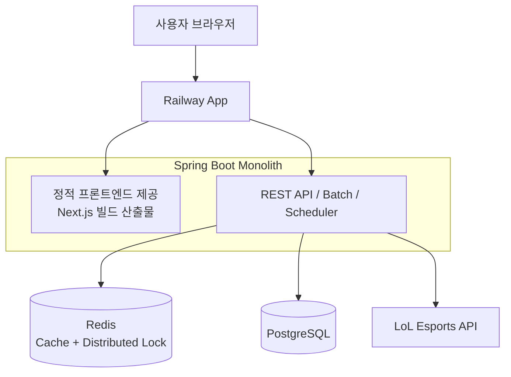

# JILoL.gg

> **백엔드 중심 프로젝트** | 외부 API 동기화 파이프라인 최적화 및 운영 안정성 강화
> **서비스**: [바로가기](https://jilolgg.up.railway.app/jikimi) / **저장소**: [GitHub](https://github.com/ji1007k/jilolgg-monolith)

LoL Esports 외부 API에서 경기·팀·리그 데이터를 동기화해 제공하는 모놀리스. Spring Boot 백엔드가 Next.js 정적 빌드 산출물을 `/jikimi` 경로로 직접 서빙한다.

## 프로젝트 목표

- **안정적인 수집**: LoL Esports 외부 API 기반 데이터의 안정적 동기화
- **데이터 무결성**: 운영자 수동 수정 데이터와 충돌 없는 조회 정합성 유지
- **운영 효율화**: 개인 프로젝트 규모에 맞춘 아키텍처로 운영 복잡도 최소화

---

## 문제 해결

### 1. 배치 처리 성능 최적화 (Throughput 개선)

- **문제**: 데이터 누적으로 단일 스레드 방식 동기화 시간이 선형 증가하여 반영 지연 발생
- **해결**: Spring Batch Partitioning 기반 병렬 처리로 리그 단위 작업 분할
- **결과**: 동기화 소요 시간 `92.5s -> 4.7s` (약 95% 단축)
- **운영값**: 파티션 동시 실행 수는 현재 고정값(`gridSize=5`). 조정 절차는 [파티션 튜닝 가이드](docs/partition-tuning-step-by-step.md) 참조

### 2. 분산 환경 동시 실행 제어 (Concurrency Control)

- **문제**: 정기 배치와 운영자 수동 실행이 겹칠 때 중복 실행/갱신 충돌 가능
- **해결**: Redisson(Redis) 분산 락으로 단일 실행 보장. 모든 동기화 진입점을 `MatchSyncOrchestratorService` 하나로 수렴시켜 락을 우회할 수 없게 함
- **인사이트**: DB 비관적 락 대신 Redis 락을 사용해 DB 커넥션 점유 리스크를 분리
- **한계**: Redis 장애 시 락이 비활성화되어 중복 실행 가능성이 있으며, DB를 기준으로 정합성을 유지하도록 설계

### 3. 조회 성능과 최신성 동시 확보 (Caching Strategy)

- **문제**: 캐시 사용 시 수정 직후 stale 데이터 노출 가능
- **해결**: TTL 기반 캐싱 + 변경 시 무효화(`invalidateAllCaches()`) 적용
- **트레이드오프**: 금일 경기 갱신 경로는 10분 주기로 자주 돌기 때문에 캐시 무효화를 의도적으로 하지 않는다. 최신성보다 부하를 택한 지점

### 4. 수동 데이터와 외부 데이터 중복 노출 해결 (Dedupe)

- **문제**: 동일 경기라도 식별자 차이로 2건 노출되는 문제
- **해결**: `match_external_mapping`으로 연결 정보를 관리하고, 조회 레이어에서 dedupe(표시 계층 병합) 적용
- **원칙**: 외부 API 원본 식별자는 **치환하지 않고 보존**하고, 표시 시점에만 병합

### 5. 아키텍처 단순화 및 운영 효율 개선 (Cost-Efficiency)

- **문제**: FE/BE 분리 운영으로 관리 포인트 증가 및 CORS 대응 부담
- **해결**: Next.js 산출물을 포함한 모놀리스 단일 배포로 전환, 동일 출처 구성으로 CORS 이슈 완화

---

## 시스템 아키텍처


```mermaid
graph TD
    User[사용자 브라우저] --> Railway[Railway App]

    subgraph App["Spring Boot Monolith"]
        Web[정적 프론트엔드 제공<br/>Next.js 빌드 산출물]
        API[REST API / Batch / Scheduler]
    end

    Railway --> Web
    Railway --> API

    API --> Redis[(Redis<br/>Cache + Distributed Lock)]
    API --> Postgres[(PostgreSQL)]
    API --> External[LoL Esports API]
```

---

## 기술 스택

| 구분 | 기술 스택 |
| --- | --- |
| **Backend** | Java 21, Spring Boot 3.5, Spring Batch, Spring Security, Spring Data JPA, Redisson |
| **Frontend** | Next.js 15, React 19 |
| **Storage** | PostgreSQL, Redis |
| **Infra** | Railway, Docker, GitHub Actions, Firebase Admin SDK |

---

## 로컬 실행

### 사전 준비

| 항목 | 버전 | 비고 |
| --- | --- | --- |
| JDK | 21 | |
| Node.js | 22 | 프론트엔드를 함께 빌드할 때만 |
| PostgreSQL | 16+ | `localhost:5432` |
| Redis | 7+ | `localhost:6379` |

DB와 계정을 만든다. 접속 정보는 `src/main/resources/application-dev.properties`에 있다.

```bash
psql -U postgres -c "CREATE USER jikim WITH PASSWORD 'jikim';"
psql -U postgres -c "CREATE DATABASE basic OWNER jikim;"
```

Redis는 도커로 띄워도 된다.

```bash
docker run -d --name jilolgg-redis -p 6379:6379 redis:7
```

### JWT 키 준비

JWT 서명용 RSA 개인키는 **저장소에 포함하지 않는다.** 최초 1회 직접 만들어야 한다.

```bash
mkdir -p secrets
openssl genpkey -algorithm RSA -pkeyopt rsa_keygen_bits:2048 -out secrets/app.key
openssl rsa -in secrets/app.key -pubout -out src/main/resources/jwt/app.pub
```

- `secrets/`는 `.gitignore` 대상이다. **개인키를 커밋하지 말 것.**
- 공개키(`src/main/resources/jwt/app.pub`)는 비밀이 아니라 classpath에 둔다. 개인키를 새로 만들면 **공개키도 반드시 같이 갱신**해야 한다. 짝이 맞지 않으면 로그인은 되지만 이후 모든 요청이 401이 된다.
- 키 위치는 `JWT_PRIVATE_KEY_LOCATION`으로 바꿀 수 있다. 기본값은 `file:./secrets/app.key`.
- 운영 환경 주입 방식은 [시크릿 관리 설계](docs/secret-management.md) 5절 참조.

### 백엔드 실행

```bash
./gradlew bootRun -Dspring.profiles.active=dev
```

- 프로필 기본값이 **prod**라 `dev` 지정이 필수다. 빠뜨리면 DataSource 설정이 없어 기동에 실패한다.
- 테이블 생성과 시드 데이터 주입은 기동 시 `spring.sql.init`이 `db/postgres/schema.sql`, `data.sql`을 실행해 자동으로 처리한다. 별도 마이그레이션 명령이 없다.
- 기동 후 확인:
  - 헬스 체크: `curl http://localhost:8080/csrf` → `200`
  - Swagger UI: http://localhost:8080/api/swagger-ui

### 프론트엔드 실행 (선택)

백엔드만 띄워도 API는 전부 동작한다. 프론트를 따로 개발할 때만 필요하다.

```bash
cd frontend
cp .env.example .env.development
npm install
npm run nextdev
```

- `npm run nextdev`는 순수 Next dev 서버다. **이쪽을 먼저 써보길 권한다.**
- `npm run dev`는 Express 커스텀 서버를 띄우며 기본값이 `USE_HTTPS=true`라 `src/config/https/`에 로컬 인증서가 필요하다. 저장소에는 인증서를 포함하지 않으므로 직접 만들어야 한다.

  ```bash
  mkcert -key-file src/config/https/localhost-key.pem -cert-file src/config/https/localhost.pem localhost
  ```

### 모놀리스로 한 번에 빌드

```bash
./gradlew build -PwithFrontend
```

`-PwithFrontend`가 있을 때만 `processResources`가 `copyFrontend`에 의존해 `frontend/out`을 `src/main/resources/static/jikimi`로 복사한다. Docker 빌드도 이 플래그를 쓴다. 백엔드만 빌드하려면 `./gradlew build`.

### 테스트

```bash
./gradlew test
```

- 테스트 DB는 H2 in-memory(`MODE=PostgreSQL`)라 로컬 PostgreSQL이 없어도 된다.
- 다만 **Redis는 mock이 아니라 실제 인스턴스에 연결**한다. `SPRING_DATA_REDIS_HOST`로 오버라이드할 수 있다.
- 배치 통합 테스트는 외부 `esports-api.lolesports.com`을 실제로 호출하므로 네트워크에 의존한다.

---

## 문서

- [개발 가이드](docs/development.md) — 개선 이력과 운영 이슈 해결 히스토리
- [트레이드오프 정리](docs/interview-tradeoffs.md) — 설계 판단의 근거와 포기한 것
- [파티션 튜닝 가이드](docs/partition-tuning-step-by-step.md) — 관찰 지표와 롤백 기준
- [성능 최적화 리포트](docs/report/optimization/summary.md)
- [시크릿 관리 설계](docs/secret-management.md)
- [확장 대비 계획](docs/scaling-readiness-plan.md)
- [ERD](docs/erd.md)
- [Swagger API 가이드](docs/swagger-api-guide.md)
- [에이전트 작성 가이드](docs/agent-authoring-guide.md)
- [문서 색인](docs/README.md)

이전 버전 README는 [docs/archive/README-2026-08-09.md](docs/archive/README-2026-08-09.md)에 보관돼 있다.
