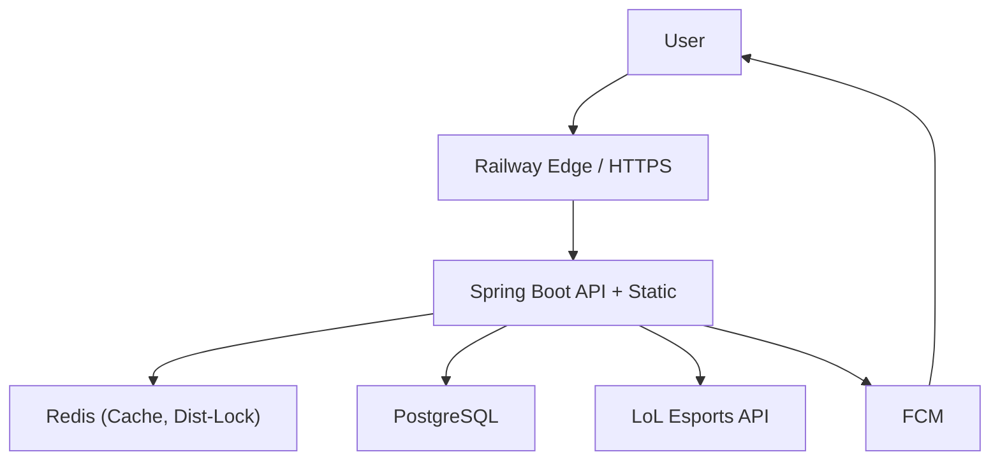

# JILoL.gg

운영 안정성과 성능 최적화에 집중한 LoL e스포츠 정보 서비스 프로젝트입니다.  
초기 단순 기능 구현에서 출발해, 실제 운영 관점의 병목을 해결하며 아키텍처를 개선했습니다.

- 서비스: [https://jilolgg.up.railway.app/jikimi](https://jilolgg.up.railway.app/jikimi)
- 저장소: [https://github.com/ji1007k/jilolgg-monolith](https://github.com/ji1007k/jilolgg-monolith)

## 1. 프로젝트 한눈에 보기

- 목적: LoL e스포츠 일정/결과/순위 조회 및 알림 제공
- 핵심 가치:
  - 대용량 외부 API 동기화 최적화
  - 인증/보안 강화(JWT + HttpOnly Cookie)
  - 운영 복잡도와 인프라 비용 절감
- 주요 사용자 기능:
  - 리그/토너먼트/경기 정보 조회
  - 회원가입/로그인 기반 개인화
  - FCM 푸시 알림

## 2. 기술 스택

- Backend: Java 17, Spring Boot 3, Spring Security, Spring Batch, Spring Data JPA
- Frontend: Next.js 15 (Static Export), React 19, TailwindCSS, PostCSS
- Data: PostgreSQL, Redis, Redisson(분산 락)
- Infra/Deploy: Railway, Docker, GitHub Actions, Firebase Admin SDK(FCM)

## 3. 아키텍처 요약

초기에는 FE/BE 분리 + 프록시 계층 중심 구조였고, 현재는 Next.js 정적 빌드를 Spring Boot 정적 리소스로 통합해 단순한 단일 배포 흐름으로 개선했습니다.



## 4. 문제 해결과 성과

### 4-1. 배치 동기화 성능 개선
- 문제: 외부 LoL API 동기화 시 I/O 병목과 처리 시간 증가
- 해결: Spring Batch 파티셔닝 + 병렬 Chunk 처리
- 성과: 동기화 처리 시간 `92.5초 → 4.7초` (약 95% 단축)

### 4-2. 분산 환경 동시성 제어
- 문제: 스케줄/수동 갱신 중복 실행 위험
- 해결: Redisson 기반 분산 락 적용
- 성과: 다중 인스턴스 환경에서도 중복 배치 실행 방지

### 4-3. 인증/보안 구조 고도화
- 문제: CORS/쿠키/CSRF와 무상태 JWT 구조 간 충돌
- 해결: HttpOnly 쿠키 기반 JWT + 무상태 CSRF 검증 방식 정리
- 성과: 보안 요구사항을 유지하며 운영 환경 인증 안정화

### 4-4. 조회 성능 최적화
- 문제: 반복 조회로 DB 부하 증가
- 해결: 데이터 성격별 Redis TTL 전략 + 배치 후 CacheEvict
- 성과: 캐시 적중 기반 응답 안정화 및 DB 리드 부하 완화


## 5. 실행 방법

### 5-1. 통합 실행(권장)

프로젝트 루트에서 실행:

```bash
./gradlew build
./gradlew bootRun
```

- `build` 과정에서 `frontend` 빌드 결과가 `src/main/resources/static/jikimi`로 복사됩니다.
- 기본 접근 경로: `http://localhost:8080/jikimi`

### 5-2. 프론트엔드 단독 작업

```bash
cd frontend
npm install
npm run dev
```

## 6. 디렉토리 구조

```text
jilolgg/
├─ src/main/java/                  # Spring Boot 애플리케이션
├─ src/main/resources/
│  ├─ application.yml
│  ├─ static/jikimi/               # Next.js export 결과물
│  └─ db/postgres/                 # DB 스키마/초기 데이터
├─ frontend/                       # Next.js 소스
├─ docs/                           # 아키텍처/개선/성능 보고서
├─ build.gradle                    # FE-BE 통합 빌드 설정
└─ Dockerfile
```
<!-- 
## 7. 문서 링크

- 아키텍처: `docs/architecture.md`
- 개선 포인트: `docs/development.md`
- 인프라/배포: `docs/infra.md`
- 성능 보고서: `docs/report/optimization/performance-report.md`
- 캐싱 보고서: `docs/report/optimization/caching-report.md`

## 8. 개선 예정

- OAuth2 소셜 로그인
- 테스트 커버리지 강화
- 전역 예외 처리 확장

## 9. 회고

이 프로젝트는 "기능 완성"보다 "운영 가능한 구조"에 집중해 성장한 기록입니다.  
특히 병목 측정, 배치/캐시/락 최적화, 배포 자동화까지 이어진 경험을 통해 프로덕트 엔지니어링 관점의 문제 해결 역량을 강화했습니다. -->
