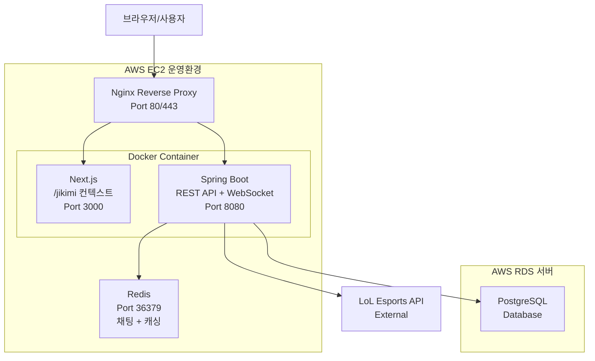

[← 이전 페이지로 돌아가기](../README.md)

## 시스템 아키텍처 다이어그램 

```mermaid
graph TD
    User[브라우저/사용자] --> Nginx
    
    subgraph EC2 ["AWS EC2 운영환경"]
        Nginx[Nginx Reverse Proxy<br/>Port 80/443]
        Redis[Redis<br/>Port 36379<br/>채팅 + 캐싱]
        
        subgraph Docker ["Docker Container"]
            NextApp[Next.js<br/>/jikimi 컨텍스트<br/>Port 3000]
            Backend[Spring Boot<br/>REST API + WebSocket<br/>Port 8080]
        end
    end
    
    subgraph RDS ["AWS RDS 서버"]
        PostgreSQL[PostgreSQL<br/>Database]
    end
    
    LoLAPI[LoL Esports API<br/>External]
    
    Nginx --> NextApp
    Nginx --> Backend
    Backend --> Redis
    Backend --> PostgreSQL
    Backend --> LoLAPI
```