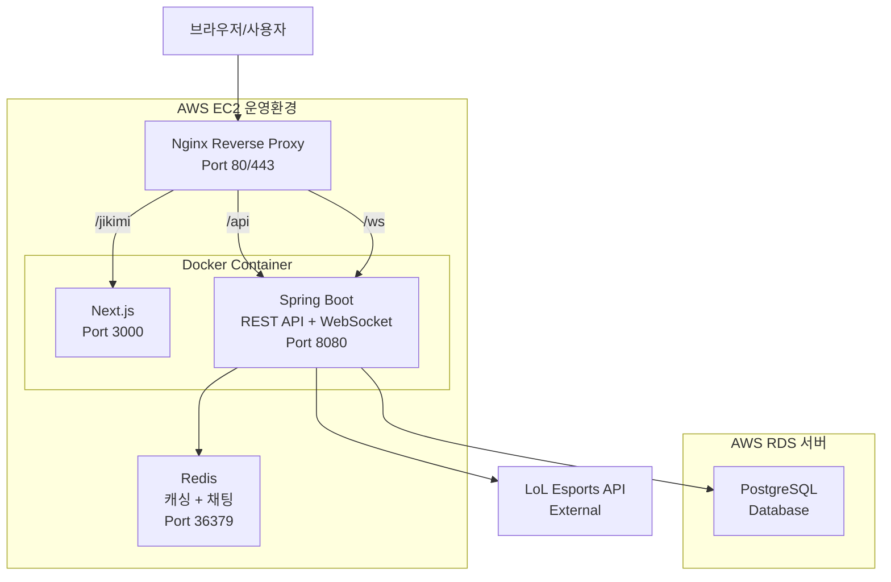

[← 이전 페이지로 돌아가기](../README.md)

## 시스템 아키텍처 (Legacy 기록)
- 이 문서는 과거 AWS EC2 + Nginx + WebSocket 운영 구조를 기록한 이력 문서입니다.
- 현재 운영 아키텍처는 `README.md`의 `개선된 통합 시스템 아키텍처 (Current)`를 기준으로 합니다.
- 단일 EC2 인스턴스에서 Nginx 리버스 프록시를 통해 Next.js 프론트엔드와 Spring Boot 백엔드를 통합 도메인으로 운영
- 프론트엔드 및 백엔드 앱 Docker 컨테이너화
- Redis는 캐싱과 실시간 채팅 메시지 중계 역할을 담당하고, PostgreSQL은 AWS RDS로 분리 운영
- Spring Boot는 LoL Esports API와 연동하여 데이터를 수집

