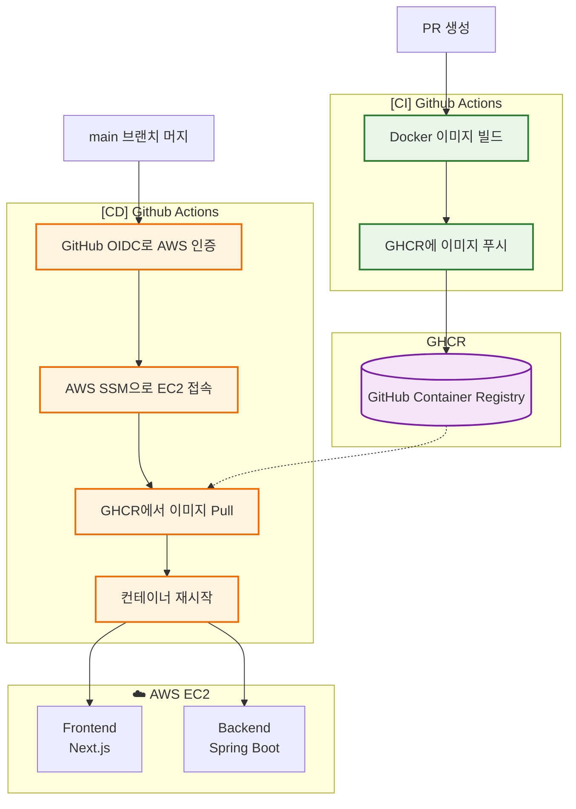

[← 문서 인덱스로 돌아가기](../../README.md)

## 프로젝트 개요

* **이름**: basic-be-springboot
* **스택**:

  * Spring Boot (Java Backend)
  * Docker 기반 컨테이너화
  * GitHub Actions + GHCR + AWS EC2 배포
  * AWS SSM (Session Manager)로 원격 명령 실행

---

## EC2 준비 사항

- EC2 인스턴스는 다음 조건을 만족해야 함:
  - SSM Agent 설치 및 활성화
  - IAM Role 연결 (SSM 접근 가능해야 함)
  - Docker 설치 및 실행 중

---

## 인증 및 권한 관리

GitHub Actions와 AWS 리소스 간 안전한 인증을 위해 GitHub OIDC(OpenID Connect)와 AWS IAM Role을 사용합니다.  
[참고](./infra-authentication.md)

---

## CI/CD 아키텍처 흐름도



---

## \[CI] Build Workflow

> **파일**: `.github/workflows/build.yml`

### 작동 트리거

* `main` 브랜치 대상 PR 열림/동기화/재열림 시 실행

### 주요 작업 순서

1. **Checkout**: PR의 코드를 Actions 환경에 체크아웃
2. **Docker Buildx 세팅**: 멀티 플랫폼 빌드 환경 구성
3. **GHCR 로그인**: GitHub Container Registry 인증
4. **REPO\_URL 설정**: 환경 변수에 GHCR 이미지 경로 저장
5. **Docker Build & Push**: Dockerfile로 이미지 빌드 후 `ghcr.io/<org>/<repo>:latest`로 푸시

---

## \[CD] Deploy Workflow

> **파일**: `.github/workflows/deploy-ssm-oidc.yml`

### 작동 트리거

* `main` 브랜치로 **직접 push** 될 때 자동 실행

### 주요 작업 순서

1. **Checkout**: 배포 시점의 최신 코드 확보
2. **AWS 인증**: OIDC 기반 Assume Role로 AWS 인증
3. **GHCR 로그인**: EC2 내에서 Docker 이미지 pull 가능하도록 로그인
4. **SSM 배포 명령 실행**:

  * 컨테이너 실행을 위한 명령어 리스트 작성
  * `aws ssm send-command`로 EC2 인스턴스에서 실행
  * `docker pull`, `stop`, `rm`, `run` 순서로 컨테이너 재시작

---

## 인프라 구성 디렉토리

```
basic-be-springboot/
├── src/
├── .github/
│   └── workflows/
│       ├── build.yml
│       └── deploy-ssm-oidc.yml
├── Dockerfile
├── compose.yaml
```

---

## GitHub Secrets 보안 환경변수

| 키                     | 설명                |
| --------------------- | ----------------- |
| `GHCR_PAT`            | GHCR 인증용 토큰 (PAT) |
| `AWS_ACCOUNT_ID`      | AWS 계정 ID         |
| `AWS_DEPLOY_ROLE`     | 배포용 IAM Role 이름   |
| `AWS_REGION`          | AWS 리전            |
| `AWS_SSM_INSTANCE_ID` | EC2 인스턴스 ID       |

---

## 장점 및 한계

**장점**

* GHCR로 이미지 관리 → private registry 불필요
* SSM 사용으로 SSH 키 없이 EC2 관리 가능

**한계**

* 무중단 배포 아님 (기존 컨테이너 stop 후 새로 실행)
* `docker compose`가 아닌 단일 컨테이너 실행 (서비스 많아질 경우 비효율)
  * 단일 서비스에서 docker compose 사용 시 전체 프로젝트를 git pull 해야 하는 오버헤드 발생
  * ∴ 추후 서비스 많아질 경우 docker compose 전환 고려
