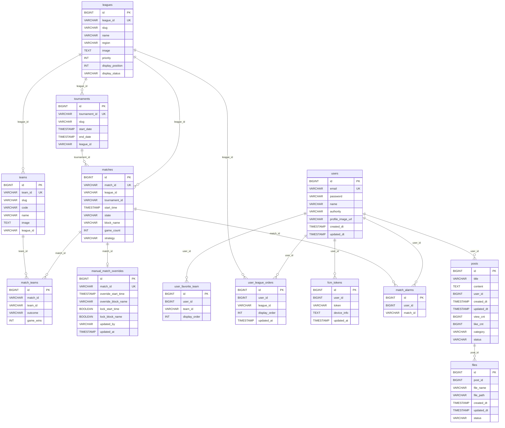

# ERD

기준: `src/main/resources/db/postgres/schema.sql` (현재 코드 기준)

## Mermaid ERD

## Notes
- 일부 관계는 JPA 매핑 기준으로는 연관되어 있지만, DB 레벨 `FOREIGN KEY` 제약은 스키마에 명시되지 않은 구간이 있습니다.
- 운영에서 무결성을 강하게 보장하려면 FK 제약 추가를 별도 마이그레이션으로 관리하는 것을 권장합니다.
